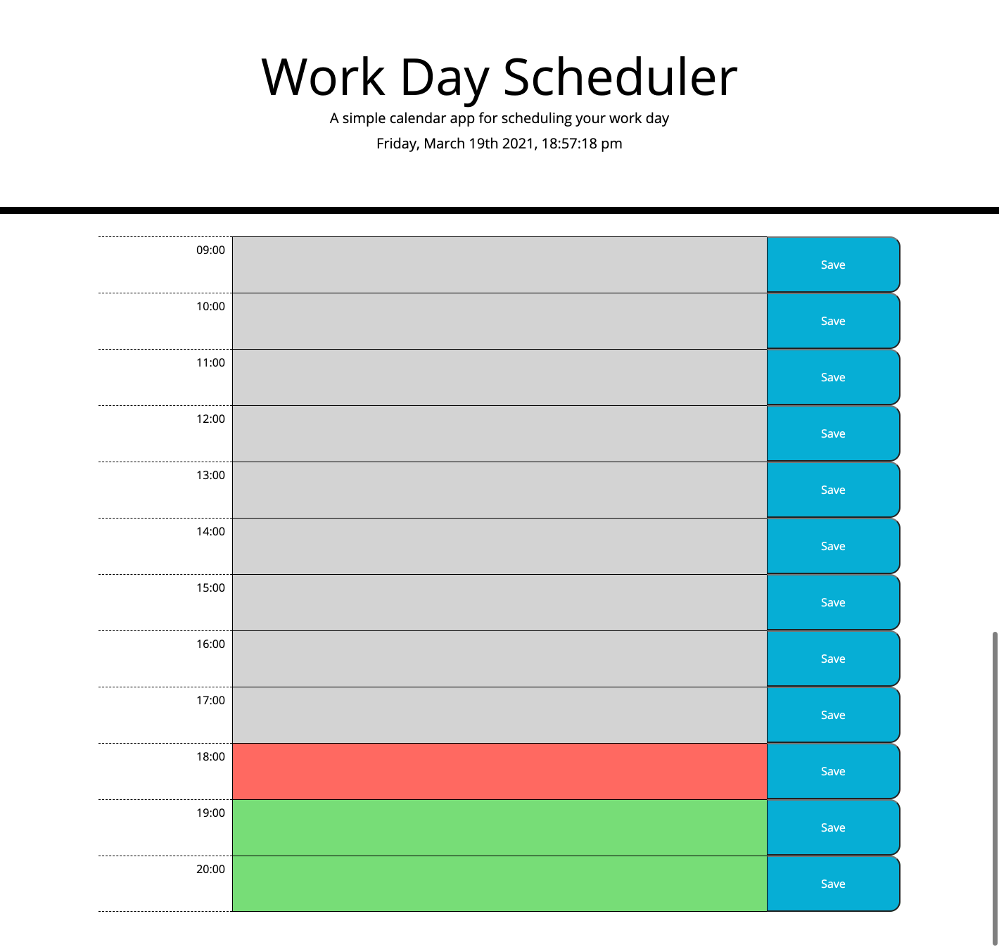

# Work Day Scheduler

## Description

This repository contains a calendar application that allows a user to save events for each business hour of the day. The current day and hour is displayed in the header. Each timeblock is colored indicating whether it is in the past, present, or future.

## Mockup


## Pseudo Code

```
Display the day

The user insert a text
The user clicks the save button
  The text and the hour of that time-block will be saved in the localStorage
  When the app is refreshed, it loads the content fron the localStorage

The blocks are styled depending of the time
  If the time is less than the time-block hour then add a class of past (grey)
  If the time is equal than the time-block hour then add a class of present (red)
  If the time is more than the time-block hour then add a class of future (green)

```

## Deployed Application

Website URL: <a href="https://itsraulsanz.github.io/plan-your-day/">https://itsraulsanz.github.io/plan-your-day/</a>

